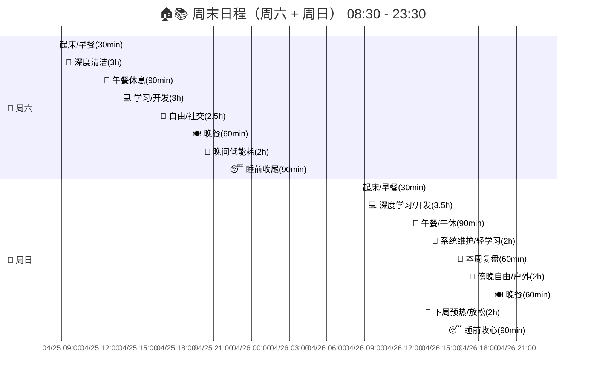

# 📋 个人成长 & 生活平衡日程表（优化版）

> **设计原则**：每个时间段提供 A/B/C 多个选项，根据当天精力状态灵活选择，不必全做。
>
> **颜色图例**：🔴 `红色` = 核心成长（英语/刷题/开发） · 🔵 `蓝色` = 主时间块 · 🟣 `蓝纹` = 规划/社交 · ⚪ `灰色` = 休息/放松
>
> **时间范围**：08:30 ~ 23:30

---

## 📅 工作日日程（周一 ~ 周四）

```mermaid
gantt
    title 📅 工作日日程（周一至周四） 08:30 - 23:30
    dateFormat HH:mm
    axisFormat %H:%M
    todayMarker off

    section 📅 工作日
        🌅 晨间自选(30min)       :a1, 08:30, 30min
        🚌 上班通勤(60min)       :a2, 09:00, 60min
        🍱 午休恢复(60min)       :a3, 12:30, 60min
        🚌 下班通勤(60min)       :a4, 18:00, 60min
        🌙 晚间保底(60min)       :crit, a5, 21:30, 60min
        😴 睡前收尾(60min)       :a6, 22:30, 60min
```

### 📋 工作日各时段可选任务

| 时段 | 时间 | 选项 A | 选项 B | 选项 C |
|------|------|--------|--------|--------|
| 🌅 晨间自选 | 08:30-09:00 | 🔴 英语口语(10min) | 🟣 日计划(5min) | ⚪ 补觉(30min) |
| 🚌 上班通勤 | 09:00-10:00 | 🔴 英语影子跟读(30min) | 🟣 找对象·线上筛选(10min) | ⚪ 纯放空(60min) |
| 🍱 午休恢复 | 12:30-13:30 | ⚪ 零社交恢复(30min) | 🟣 回复找对象消息(5min) | — |
| 🚌 下班通勤 | 18:00-19:00 | 🔴 英语自言自语(20min) | 🔴 智能体开发·听(20min) | ⚪ 纯放空(60min) |
| 🌙 晚间保底 | 21:30-22:30 | 🔴 保底·刷题(30min) | 🔴 保底·开发(30min) | ⚪ 彻底休息(60min) |
| 😴 睡前收尾 | 22:30-23:30 | 🟣 当日极简复盘(5min) | ⚪ 个人护理/睡前准备 | ⚪ 轻度阅读/助眠放松 |

---

## 🏠📚 周末日程（周六 + 周日）

> **周六** = 深度清洁日（清洁优先） · **周日** = 深度学习/开发日（开发优先）

### 📋 周六各时段可选任务

| 时段 | 时间 | 选项 A | 选项 B | 选项 C/D/E |
|------|------|--------|--------|------------|
| 🧹 深度清洁 | 09:00-12:00 | 🔴 洗内衣/袜子 | 🔴 整理衣物 | 🔴 拖地/吸尘 · 洗澡 · 机洗衣服 |
| 🍱 午餐休息 | 12:00-13:30 | ⚪ 做饭/外卖/用餐 | ⚪ 午间小憩/放空 | — |
| 💻 学习/开发 | 13:30-16:30 | 🔴 独立开发/智能体实战 | 🔴 刷题/技术阅读 | — |
| 🎯 自由/社交 | 16:30-19:00 | 🟣 找对象·见面/聊天(90min) | ⚪ 爱好/补觉/娱乐 | — |
| 🌙 晚间低能耗 | 20:00-22:00 | 🟣 项目轻回顾(15min) | ⚪ 娱乐/社交/彻底放松 | 🟣 提前写周计划草稿(5min) |
| 😴 睡前收尾 | 22:00-23:30 | 🟣 周末状态复盘(5min) | ⚪ 个人护理/助眠放松 | ⚪ 深夜轻度娱乐 |

### 📋 周日各时段可选任务

| 时段 | 时间 | 选项 A | 选项 B | 选项 C |
|------|------|--------|--------|--------|
| 💻 深度学习/开发 | 09:00-12:30 | 🔴 独立开发·主攻(180min) | 🔴 智能体开发·复现(30min) | — |
| 🔧 系统维护/轻学习 | 14:00-16:00 | 🟣 系统维护(清理电脑/备份) | 🟣 技术文章阅读/笔记整理 | — |
| 📝 本周复盘 | 16:00-17:00 | 🟣 本周复盘(40min) | 🟣 找对象·快速评估(1min) | — |
| 🚶 傍晚自由/户外 | 17:00-19:00 | 🟣 散步/运动/社交 | ⚪ 娱乐/爱好 | — |
| 🔄 下周预热/放松 | 20:00-22:00 | 🟣 下周微启动(5min) | ⚪ 个人护理/放松仪式 | ⚪ 轻度娱乐 |
| 😴 睡前收心 | 22:00-23:30 | 🟣 次日衣物/物品准备(30min) | ⚪ 助眠放松/早睡准备 | ⚪ 轻度阅读/无屏幕放松 |

---

## 💡 使用建议

### 🎯 选择策略
- **精力充沛** → 优先选 🔴红色（核心成长任务）
- **精力一般** → 选 🟣蓝纹（规划/社交类轻任务）
- **精力低迷** → 放心选 ⚪灰色（休息放松，恢复为主）

### ⚡ 核心原则
1. **不求全做**：每个时间段只选 1 个选项，做完即可
2. **保底优先**：晚间保底任务是每天最低目标，优先保证
3. **灵活切换**：同一时段的 A/B/C 可根据状态随时切换
4. **周末整块**：周六清洁、周日开发，尽量保持整块不被打断

### 📈 每周核心成长上限（全选红色选项时）

> ⚠️ 以下为**理论上限**，即每个时段都选核心成长选项（A）的情况。实际按精力灵活选择，不必全做。

| 目标 | 工作日（周一~周四，4天） | 周末（周六+周日） | 周上限 |
|------|------------------------|------------------|--------|
| 英语 | 60min/天 × 4 = 240min | — | **~4h** |
| 刷题 | 30min/天 × 4 = 120min | 周六可选180min | **~5h** |
| 开发 | 30min/天 × 4 = 120min | 周六180min + 周日210min | **~8.5h** |
| 找对象 | 15min/天 × 4 = 60min | 周六见面90min | **~2.5h** |

> **说明**：工作日英语含口语(10min)+影子跟读(30min)+自言自语(20min)三个通勤选项；工作日开发仅计保底·开发(30min)，不含通勤被动听(20min)；周五晚归入周末计算。
