# 📋 个人成长 & 生活平衡日程表（优化版）

> **设计原则**：每个时间段提供 A/B/C 多个选项，根据当天精力状态灵活选择，不必全做。
>
> **颜色图例**：🔴 `红色` = 核心成长（英语/刷题/开发） · 🔵 `蓝色` = 主时间块 · 🟣 `蓝纹` = 规划/社交 · ⚪ `灰色` = 休息/放松

---

## 📅 工作日日程（周一 ~ 周四）

```mermaid
gantt
    title 📅 工作日日程（周一至周四）
    dateFormat HH:mm
    axisFormat %H:%M
    todayMarker off

    section 🌅 晨间自选
        晨间自选任务(30min)           :a1, 08:30, 30min
        A. 英语口语(10min)            :crit, a1a, 08:30, 10min
        B. 日计划(5min)               :active, a1b, 08:30, 5min
        C. 补觉(30min)                :done, a1c, 08:30, 30min

    section 🚌 上班通勤
        上班通勤(60min)               :a2, 09:00, 60min
        A. 英语影子跟读(30min)        :crit, a2a, 09:00, 30min
        B. 找对象·线上筛选(10min)     :active, a2b, 09:00, 10min
        C. 纯放空(60min)              :done, a2c, 09:00, 60min

    section 🍱 午休恢复
        午休恢复(60min)               :a3, 12:30, 60min
        A. 零社交恢复(30min)          :done, a3a, 12:30, 30min
        B. 回复找对象消息(5min)       :active, a3b, 12:30, 5min

    section 🚌 下班通勤
        下班通勤(60min)               :a4, 18:00, 60min
        A. 英语自言自语(20min)        :crit, a4a, 18:00, 20min
        B. 智能体开发·听(20min)       :crit, a4b, 18:00, 20min
        C. 纯放空(60min)              :done, a4c, 18:00, 60min

    section 🌙 晚间保底
        晚间保底任务(60min)           :a5, 21:30, 60min
        A. 保底·刷题(30min)           :crit, a5a, 21:30, 30min
        B. 保底·开发(30min)           :crit, a5b, 21:30, 30min
        C. 彻底休息(60min)            :done, a5c, 21:30, 60min

    section 😴 睡前收尾
        睡前收尾时段(60min)           :a6, 22:30, 60min
        A. 当日极简复盘(5min)         :active, a6a, 22:30, 5min
        B. 个人护理/睡前准备(60min)   :done, a6b, 22:30, 60min
        C. 轻度阅读/助眠放松(60min)   :done, a6c, 22:30, 60min
```

### 📊 工作日时间分配概览

| 类型 | 每日可用时间 | 说明 |
|------|-------------|------|
| 🔴 核心成长 | ~60-110min | 英语 + 刷题/开发（通勤+晚间） |
| 🟣 规划/社交 | ~15-20min | 日计划 + 找对象筛选/回复 |
| ⚪ 休息恢复 | 灵活 | 根据精力状态选择放空/补觉选项 |

---

## 🏠 周六日程（深度清洁日）

> 含周五晚过渡时段。清洁事务优先级最高，安排整块时间集中处理。

```mermaid
gantt
    title 🏠 周六日程（深度清洁日）
    dateFormat HH:mm
    axisFormat %H:%M
    todayMarker off

    section 🌃 周五晚过渡
        周五晚·周末计划/邀请(30min)   :active, b1, 21:30, 30min
        A. 周末计划(15min)            :active, b1a, 21:30, 15min
        B. 约见邀请(2min)             :active, b1b, 21:30, 2min
        周五晚·睡前放松(90min)        :b2, 22:00, 90min
        A. 周末娱乐准备(90min)        :done, b2a, 22:00, 90min
        B. 个人护理/早睡准备(90min)   :done, b2b, 22:00, 90min

    section 🌅 起床
        起床/洗漱/早餐(30min)         :c0, 08:30, 30min

    section 🧹 深度清洁（整块3h）
        深度清洁时段(180min)          :crit, c1, 09:00, 180min
        A. 洗内衣/袜子                :crit, c1a, 09:00, 180min
        B. 整理衣物                   :crit, c1b, 09:00, 180min
        C. 拖地/吸尘                  :crit, c1c, 09:00, 180min
        D. 洗澡/个人卫生              :crit, c1d, 09:00, 180min
        E. 洗衣服（机洗）             :crit, c1e, 09:00, 180min

    section 🍱 午餐休息
        午餐与休息(90min)             :c2, 12:00, 90min
        A. 做饭/外卖/用餐             :done, c2a, 12:00, 90min
        B. 午间小憩/放空              :done, c2b, 12:00, 90min

    section 💻 学习/开发（整块3h）
        学习/开发时段(180min)         :crit, c3, 13:30, 180min
        A. 独立开发/智能体实战         :crit, c3a, 13:30, 180min
        B. 刷题/技术阅读              :crit, c3b, 13:30, 180min

    section 🎯 下午自由/社交
        下午自由时段(150min)          :c4, 16:30, 150min
        A. 找对象·见面/聊天(90min)    :active, c4a, 16:30, 90min
        B. 爱好/补觉/娱乐(150min)     :done, c4b, 16:30, 150min

    section 🍽️ 晚餐
        晚餐(60min)                   :c5, 19:00, 60min

    section 🌙 晚间低能耗
        晚间低能耗时段(120min)        :c6, 20:00, 120min
        A. 项目轻回顾(15min)          :active, c6a, 20:00, 15min
        B. 娱乐/社交/彻底放松(120min) :done, c6b, 20:00, 120min
        C. 提前写周计划草稿(5min)     :active, c6c, 20:00, 5min

    section 😴 睡前收尾
        睡前收尾(90min)               :c7, 22:00, 90min
        A. 周末状态复盘(5min)         :active, c7a, 22:00, 5min
        B. 个人护理/助眠放松(90min)   :done, c7b, 22:00, 90min
        C. 深夜轻度娱乐(90min)        :done, c7c, 22:00, 90min
```

---

## 📚 周日日程（深度学习/开发日）

> 以学习和开发为核心，搭配复盘与下周预热，为新一周做好准备。

```mermaid
gantt
    title 📚 周日日程（深度学习/开发日）
    dateFormat HH:mm
    axisFormat %H:%M
    todayMarker off

    section 🌅 起床
        起床/洗漱/早餐(30min)         :d0, 08:30, 30min

    section 💻 深度学习/开发（整块3.5h）
        深度学习/开发时段(210min)      :crit, d1, 09:00, 210min
        A. 独立开发·主攻(180min)      :crit, d1a, 09:00, 180min
        B. 智能体开发·复现(30min)     :crit, d1b, 09:00, 30min

    section 🍱 午餐休息
        午餐/午休(90min)              :d2, 12:30, 90min

    section 🔧 系统维护/轻学习
        系统维护时段(120min)          :d3, 14:00, 120min
        A. 系统维护-清理电脑/备份      :active, d3a, 14:00, 120min
        B. 技术文章阅读/笔记整理       :active, d3b, 14:00, 120min

    section 📝 本周复盘
        本周复盘时段(60min)           :active, d4, 16:00, 60min
        A. 本周复盘(40min)            :active, d4a, 16:00, 40min
        B. 找对象·快速评估(1min)      :active, d4b, 16:00, 1min

    section 🚶 傍晚自由/户外
        傍晚自由时段(120min)          :d5, 17:00, 120min
        A. 散步/运动/社交(120min)     :active, d5a, 17:00, 120min
        B. 娱乐/爱好(120min)          :done, d5b, 17:00, 120min

    section 🍽️ 晚餐
        晚餐(60min)                   :d6, 19:00, 60min

    section 🔄 下周预热/放松
        下周预热/放松时段(120min)      :d7, 20:00, 120min
        A. 下周微启动(5min)           :active, d7a, 20:00, 5min
        B. 个人护理/放松仪式(120min)  :done, d7b, 20:00, 120min
        C. 轻度娱乐(120min)           :done, d7c, 20:00, 120min

    section 😴 睡前收心
        睡前收心/准备(90min)          :d8, 22:00, 90min
        A. 次日衣物/物品准备(30min)   :active, d8a, 22:00, 30min
        B. 助眠放松/早睡准备(90min)   :done, d8b, 22:00, 90min
        C. 轻度阅读/无屏幕放松(90min) :done, d8c, 22:00, 90min
```

---

## 💡 使用建议

### 🎯 选择策略
- **精力充沛** → 优先选 🔴红色（核心成长任务）
- **精力一般** → 选 🟣蓝纹（规划/社交类轻任务）
- **精力低迷** → 放心选 ⚪灰色（休息放松，恢复为主）

### ⚡ 核心原则
1. **不求全做**：每个时间段只选 1 个选项，做完即可
2. **保底优先**：晚间保底任务是每天最低目标，优先保证
3. **灵活切换**：同一时段的 A/B/C 可根据状态随时切换
4. **周末整块**：周六清洁、周日开发，尽量保持整块不被打断

### 📈 每周核心成长目标
| 目标 | 工作日(4天) | 周末(2天) | 周合计 |
|------|------------|----------|--------|
| 英语 | ~240min | - | ~4h |
| 刷题 | ~120min | ~180min | ~5h |
| 开发 | ~120min | ~390min | ~8.5h |
| 找对象 | ~60min | ~90min | ~2.5h |
